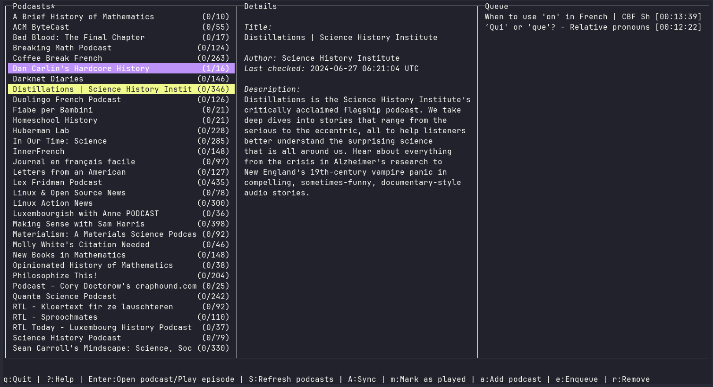

# Hullcaster

Hullcaster is a terminal-based podcast manager, built in Rust. It provides a
terminal UI (i.e., an ncurses-like interface) to allow users to subscribe to
podcast feeds, and sync feeds to check for new episodes. Episodes may be
downloaded locally, played with an external media player, and marked as
played/unplayed. Key bindings and other options are configurable via a config
file.



## Note

This is a fork of [shellcaster](https://github.com/jeff-hughes/shellcaster),
which is no longer maintained. Currently, I am planning to implement the
features stated below, while learning `rust` at the same time.

### Planned changes

- [x] Option to avoid marking as read when playing
- [x] Syncing with the gpodder API
- [x] Add playing queue
- [ ] Internal Player using [rodio](https://github.com/RustAudio/rodio)
- [x] Show key bindings in a bar on the bottom
- [ ] Migrate to [ratatui](https://ratatui.rs/) or
[Cursive](https://github.com/gyscos/cursive)
- [x] Add option to sync automatically on start, enabled by default
- [ ] Add periodic synchronization

### TODO

- [x] Syncing with gpodder episode actions API (rudimentary, tested with
  [opodsync](https://github.com/kd2org/opodsync))
- [x] Fix performance of mark-all as read
- [x] Fix bug deleting file
- [x] Show the podcast description only when a podcast is selected
- [x] Fix syncing podcasts, sometimes gets stuck (it seems timeout not working)
- [x] Support downloading subscriptions from gpodder
- [x] Support uploading subscriptions to gpodder
- [x] If gpodder is on, update actions right after syncing podcasts
- [x] Prevent screen flickering while syncing podcasts
- [x] Prevent screen flickering at the end of lists
- [x] Fix vertical screens
- [x] Clear details panel when nothing is selected
- [x] Make queue persistent
- [x] Fix crash when playing from queue
- [ ] Create lock file to prevent several instances of hullcaster
- [ ] Add option to play next from queue automatically, makes sense only after internal player is implemented
- [ ] Add history of episode actions. It seems that `AntennaPod` does not do this.
- [x] Avoid repeated elements in queue
- [ ] Fix bug where queue actions are not persistent, hard to reproduce
- [ ] Fix gpodder test, it should use local files or local server
- [x] Add panel for unplayed episodes across podcasts
- [x] Fix bug in two-column state, going to/from queue from/to episode/unplayed panel does not work
- [x] Unplayed items not sorted correctly
- [ ] Errors appear sporadically synchronizing podcasts with gpodder
- [ ] Unplayed items not updated after sync
- [ ] `~` folder created when creating logs

## Installing hullcaster

### Archlinux

The package is available in the `AUR` [hullcaster-git](https://aur.archlinux.org/packages/hullcaster-git).

### NixOS / Nix

With [flakes](https://wiki.nixos.org/wiki/Flakes) enabled, run:

```bash
nix run github:gilcu3/hullcaster
```

### On Linux distributions

Currently, the only option is to build from source.

First, ensure you have installed the necessary dependencies: `rust`, `gcc`,
`pkgconf`, `sqlite` (package names in Archlinux).

Next, you can clone the Github repo and compile it yourself:

```bash
git clone https://github.com/gilcu3/hullcaster.git
cd hullcaster
cargo build --release  # add or remove any features with --features

# no root permissions
cp target/release/hullcaster ~/.local/bin
```

## Running hullcaster

In your terminal, run:

```bash
hullcaster
```

Note that if you installed hullcaster to a different location, ensure that this
location has been added to your `$PATH`:

```bash
export PATH="/path/to/add:$PATH"
```

## Importing/exporting podcasts

Hullcaster supports importing OPML files from other podcast managers. If you can
export to an OPML file from another podcast manager, you can import this file
with:

```bash
hullcaster import -f /path/to/OPML/file.opml
```

If the `-r` flag is added to this command, it will overwrite any existing
podcasts that are currently stored in hullcaster. You can also pipe in data to
`hullcaster import` from stdin by not specifying the `-f <file>`.

You can export an OPML file from hullcaster with the following command:

```bash
hullcaster export -f /path/to/output/file.opml
```

You can also export to stdout by not specifying the `-f <file>`; for example,
this command is equivalent:

```bash
hullcaster export > /path/to/output/file.opml
```

## Configuring hullcaster

If you want to change configuration settings, the sample `config.toml` file can
be copied from
[here](https://raw.githubusercontent.com/gilcu3/hullcaster/master/config.toml).
Download it, edit it to your fancy, and place it in the following location:

```bash
# on Linux
mkdir -p ~/.config/hullcaster
cp config.toml ~/.config/hullcaster/
```

Or you can put `config.toml` in a place of your choosing, and specify the
location at runtime:

```bash
hullcaster -c /path/to/config.toml
```

The sample file above provides comments that should walk you through all the
available options. If any field does not appear in the config file, it will be
filled in with the default value specified in those comments.

### Default key bindings

| Key                               | Action                                   |
|-----------------------------------|------------------------------------------|
| ?                                 | Open help window                         |
| Arrow keys / h,j,k,l              | Navigate menus                           |
| Shift+K                           | Up 1/4 page                              |
| Shift+J                           | Down 1/4 page                            |
| PgUp                              | Page up                                  |
| PgDn                              | Page down                                |
| a                                 | Add new feed                             |
| q                                 | Quit program                             |
| s                                 | Synchronize selected feed                |
| Shift+S                           | Synchronize all feeds                    |
| Shift+A                           | Synchronize with gpodder                 |
| p                                 | Play selected episode                    |
| Enter                             | Play selected episode/open sel. podcast  |
| m                                 | Mark selected episode as played/unplayed |
| Shift+M                           | Mark all episodes as played/unplayed     |
| d                                 | Download selected episode                |
| Shift+D                           | Download all episodes                    |
| x                                 | Delete downloaded file                   |
| Shift+X                           | Delete all downloaded files              |
| r                                 | Remove selected feed from list           |
| 1                                 | Toggle played/unplayed filter            |
| 2                                 | Toggle downloaded/not downloaded filter  |
| e                                 | Push episode in queue                    |
| u                                 | Show/hide Unread list of episodes        |

**Note:** Actions can be mapped to more than one key (e.g., "Enter" and "p" both
play an episode), but a single key may not do more than one action (e.g., you
can't set "d" to both download and delete episodes).

#### Customizable colors

You can set the colors in the app with either built-in terminal colors or
(provided your terminal supports it) customizable colors as well. See the
"colors" section in the
[config.toml](https://github.com/gilcu3/hullcaster/blob/master/config.toml) for
details about how to specify these colors!

## Syncing without the UI

Some users may wish to sync their podcasts automatically on a regular basis,
e.g., every morning. The `hullcaster sync` subcommand can be used to do this
without opening up the UI, and does a full sync of all podcasts in the database.
This could be used to set up a cron job or systemd timer, for example. Please
refer to the relevant documentation for these systems for setting it up on the
schedule of your choice.
